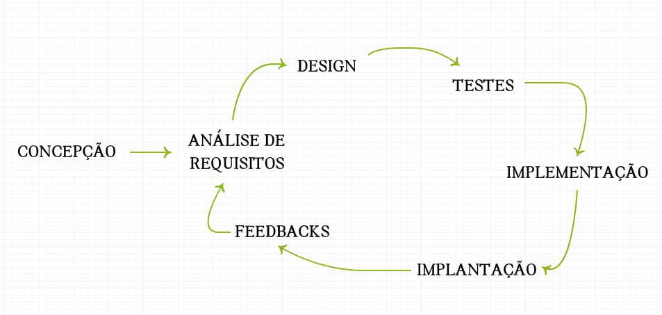
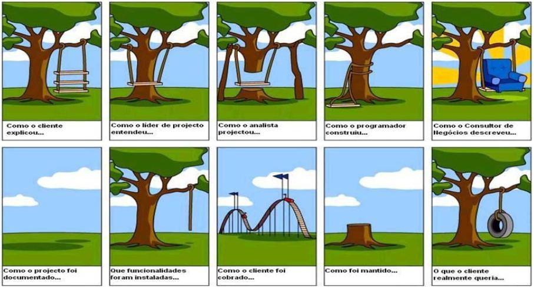

### Jornada de um Projeto

Um projeto, geralmente, passa por algumas etapas durante o seu desenvolvimento:

1. Concepção
2. Análise de Requisitos
3. Design
4. Testes
5. Implementação
6. Implantação
7. Feedback e melhorias

Vale lembrar que o processo é cíclico, logo, após a etapa de concepção, ele passa de **Feedbacks e melhorias** para **Análise de Requisitos**.



Como estamos utilizando um framework ágil que permite iterações para entregar valor ao cliente e usuário de uma forma contínua, podemos repetir esse processo para cada Sprint Backlog definido.

---

#### Concepção

<p style="text-align: center">
  
</p>

Esta é a etapa inicial do projeto onde o cliente, ou um time, expõe os problemas que gostariam de resolver. Geralmente é utilizado a técnica de **brainstorming**, porém ela é ineficiente, por não ter um objetivo muito claro, por se parecer muito com uma reunião e representar um custo elevado para a empresa. Pode se assemelhar também a uma brincadeira, por não ter bem definido o momento que deverá acabar.

Para contornar esse problema, podemos fazer um jogo: o **gamestorming**. Ele consiste dos seguintes elementos:

1. **Tempo**: o tempo precisa ser controlado do início ao fim na fala, apresentação ou posicionamento de alguém.
2. **Ambiente**: o espaço do jogo deve fornecer toda a infraestrutura necessária para um bom jogo.
3. **Objetivo**: os objetivos devem estar claros.

Uma das formas de se ter ideias de aplicações é **pensar em soluções para problemas**.

Podemos utilizar *post-its* para anotar as ideias e classificá-las em categorias. Após isso time vota a ideia que irá trabalhar e podemos passar para a primeira frase iterativa: a análise de requisitos.

---

#### Análise de Requisitos



Essa é a etapa em que levantamos as funcionalidades da aplicação. É importante frisar que não se deve especificar todas as funcionalidades de início. Primeiro porque é impossível prever todas as funcionalidades. Segundo que as funcionalidades mudam! Os ciclos do processo farão com que as funcionalidades já existentes mudem e que grandes erros desapareçam logo no início do projeto, além de gerar novas funcionalidades a partir das já desenvolvidas.

Logo, é recomendado que façamos apenas um Product Backlog básico, utilizando o formato de história de usuário.

```
VISUALIZAR CATÁLOGO

Como usuário
Quero ver o catálogo de séries categorizado
Para decidir o que vou assisir
```

É importante lembrar que a história de usuário é **voltada para negócio**, logo não faz sentido implementar a partir do ponto de vista do usuário. É preciso quebrar a história em itens técnicos, para assim os desenvolvedores conseguirem implementar.

As histórias de usuário se encaixam na categoria de **requisitos funcionais**, que são funcionalidades essenciais de uma aplicação. Existem outros tipos de requisitos que iremos explicar mais a frente do curso.

---

#### Design


Geralmente esta etapa se mistura com a anterior. Neste curso iremos aprender sobre Experiência de Usuário (UX). UX é basicamente uma área que envolve um conjunto de áreas (desde design de interfaces a desenvolvimento de sistemas) em prol da experiência que o usuário terá ao utilizar o produto ou serviço. Ela oferece diversas técnicas e entregáveis para nos guiar nas etapas de análise de requisitos, design e testes.

Uma das técnicas que aprenderemos é o **cardsorting**, que é uma técnica utilizada na área de Arquitetura da Informação para ordenar e classificar informações dentro de uma página ou seção de uma página.

Podemos expandir a história de usuário e transformá-la de fato em uma funcionalidade descrita através de passos. Por exemplo, para a funcionalidade VISUALIZAR CATÁLOGO:

```
VISUALIZAR CATÁLOGO

Como usuário quero ver o catálogo de séries categorizado para decidir o que vou assistir

Dado que eu esteja logado
Quando eu clicar em "Catálogo"
Então eu vou para a página de séries
E se eu clicar na categoria "Ficcção Científica" no menu de categorias
Então eu vejo as séries de "Ficção Científica"
```

Esse é um formato bem utilizado no BDD (Desenvolvimento Orientado a Testes), onde estabelecemos cenários e passos para a funcionalidade. Isso facilita o **fluxograma de ações** que fazemos nessa etapa, entre o desenvolvimento de outros entregáveis, inclusive ajuda a validar a usabilidade com **testes de usabilidade**.

Dois dos entregáveis que aprenderemos é o **wireframe** e o **protótipo**. O wireframe é um desenho de páginas de baixa fidelidade apenas para sabermos o que é importante. O protótipo é responsável por mostrar como será o fluxo de navegação.


---

#### Testes

Os testes vem antes da implementação por utilizarmos o TDD (desenvolvimento guiado a testes), onde estabelecemos **testes unitários e de integração** antes de codificarmos, o teste falha, codificamos, o teste passa, refatoramos e começamos tudo de novo. Isso garante confiabilidade e segurança da aplicação.

Já com as histórias de usuário com cenários definidas na etapa anterior, podemos utilizá-las para fazer os **testes de aceitação** do BDD, que é simplemente a validação dos passos descritos. É um teste muito mais semântico do que de código, como o TDD nos guia a fazer.

<p style="text-align: center">
  
</p>

---

#### Implementação

Após termos a história de usuário bem definida, um fluxograma de ações, um wireframe ou protótipo da funcionalidade, juntamente com os testes unitários, de integração e de aceitação é feita a implementação da funcionalidade.

Lembremos que os sub-itens técnicos foram criados na Planning Meeting.


---

#### Implantação

A implantação é a etapa de colocar a aplicação num servidor em cloud (no nosso caso), utilizamos o [Heroku](http://heroku.com), ele possui suporte à Ruby, ao framework Rails e ao sistema gerenciador de banco de dados PostgreSQL.

<p style="text-align: center">
  
</p>

É desejável que deploys (essa tarefa de colocar a aplicação no servidor) seja feita regularmente após a tarefa estar **pronta**, ou seja: **teste de aceitação + desenvolvimento + review de código + aprovação**.

---

#### Feedbacks e melhorias

O cliente ou usuários dão feedbacks e levantam correções ou melhorias das funcionalidades desenvolvidas na sprint.

O processo volta para a etapa **análise de requisitos**.

