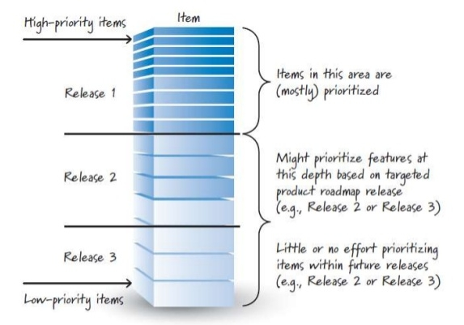

## Artefatos do Scrum

### Product Backlog

É a lista de funcionalidades do projeto. É o artefato que ajuda o Product Owner a manter tudo organizado, ele é o responsável por manter atualizado e priorizado de modo a agregarmos o máximo de valor possível em cada sprint.

<p style="text-align: center">
  
</p>

Embora o cliente, usuários e o próprio time tenham a liberdade de influenciar mudanças no Product Backlog, a única pessoa que de fato pode alterar é o Product Owner - tanto que o nome desse papel é esse por ele ser o dono do Product Backlog. Os itens do Product Backlog são sempre mutáveis: o Product Owner pode sempre adicionar, remover e re-priorizar itens de forma a agregar mais valor ao projeto.

---

### Sprint Backlog

Após a discussão dos itens do Product Backlog devidamente priorizado na Planning Meeting, eles são quebrados em itens técnicos e, se escolhidos para serem executados, esses itens e sub-itens farão parte do chamado Sprint Backlog, que é uma lista ordenada de itnes funcionais e seus sub-itens técnicos que serão feitos pelo time durante a sprint.

<p style="text-align: center">
  
</p>

Diferente do Product Backlog, apenas o time pode influenciar e alterar o Sprint Backlog. O Sprint Backlog é formado pelos itens mais prioritários do Product Backlog e indica seriamente os problemas sistêmicos. Se os itens mais prioritários precisarem sofrer grandes modificações ou não fizer mais sentido no tempo da sprint, isso significa que o Product Owner não fez um bom trabalho em refinar e de descobrir o que os usuários realmente precisam.

--- 

### Histórias e Tarefas

Cada item do Product Backlog corresponde a uma funcionalidade do sistema, que agrega valor para o usuário final.

O item deve ter o formato de história de usuário. A história de usuário é um formato criado em XP para representar um item que agrega valor a usuários e agrega, de forma bastante simples, três informações importantíssimas para a priorização e posterior desenvolvimento: **por quê**, **para quem** e **o que**. O modelo de história de usuário é o seguinte:

```
TÍTULO DA FUNCIONALIDADE

Como [para quem é importante]
Quero [o que se deve fazer]
Para [por que é importante]
```

Por exemplo, num sistema de séries online temos:

```
VISUALIZAR CATÁLOGO

Como usuário
Quero ver o catálogo de séries categorizado
Para decidir o que vou assisir
```

Durante a Planning Meeting, os desenvolvedores deve verificar o entendimento da história quebrando-a em itens técnicos - que não necessariamente vão entregar valor ao usuário. Esses itens técnicos são chamados de **tarefas**. A história de usuário acima pode ser quebrada nas seguintes tarefas:

- Cadastro de séries no banco de dados
- Cadastro de categorias de séries no banco de dados
- Limite de séries que serão exibidas no catálogo
- Filtro de séries por categoria no catálogo