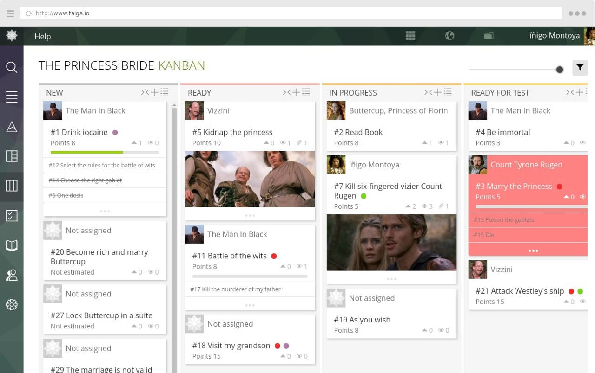
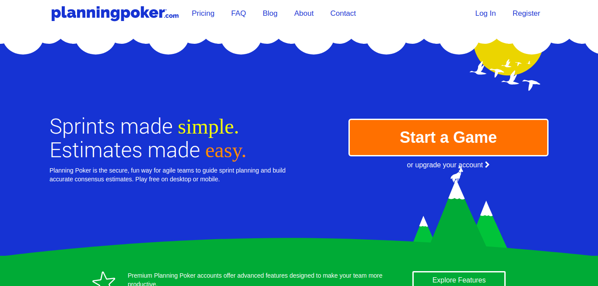

## Ferramentas

### Taiga

O Taiga é uma plataforma para gestão de projetos de times que utilizam frameworks ágeis como o Scrum. Ele possui uma estrutura pronta como Product Backlog, possibilidade de criar sprints e documentá-las, além de medir a velocidade do time, baseado no nível de dificuldade de cada história de usuário.

> Free. Open Source. Powerful. Taiga is a project management platform for startups and agile developers & designers who want a simple, beautiful tool that makes work truly enjoyable.

---

### Planning Poker

O Planning Poker é uma plataforma para facilitar a estimativa de dificuldade para cada história de usuário do Product Backlog.

> Sprints made simple. Estimates made easy.
> Planning Poker is the secure, fun way for agile teams to guide sprint planning and build accurate consensus estimates. Play free on desktop or mobile.

