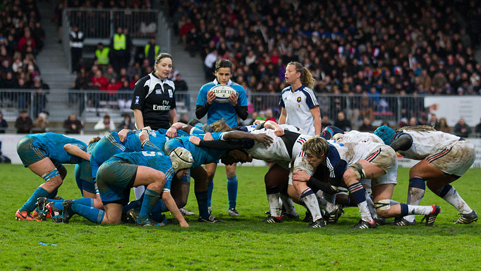

### História do Scrum

O *Scrum* é um reinício de jogada no Rugby, onde os jogadores dos dois times se juntam com as cabeças abaixadas e se empurram com o objetivo de tomar a posse da bola.

Se quebrarem a formação, o time perde a posse, mas se conseguirem a posse o time todo é responsável pelo sucesso.

Em 1995, Jeff Sutherland e Ken Schwaber aproveitaram o nome dado a essa formação e nomearam o processo que se tornou mundialmente conhecido: o *método Scrum*. 

Vale dizer que o *Scrum* deixou de ser um método com o passar dos anos para se tornar um *framework*, pois um método se diz **como** se deve fazer, mas o *Scrum* diz *o que* deve ser feito.

---

### Time-boxes

Time-boxes são caixas de tempo de tamanho bem definido e que não pode ser alterado, uma vez que já tenha se iniciado.

O *Scrum* é um framework iterativo e incremental, isto quer dizer que o time **fatia a lista** de coisas que precisam ser feitas no projeto em pequenas partes que entreguem valor ao cliente ou usuário, seguindo a ordem de prioridade, **trabalham nas funcionalidades** mais prioritárias e, frequentemente, validam com o cliente se estão no caminho certo.

O desenvolvimento em pequenas partes é chamado no *Scrum* de **sprint**, que é uma corrida rápida para marcar pontos, no Rugby. Para nós, a sprint é o tempo que o time tem para entregar algo de valor para o usuário ou cliente.

---

### Sprint

Ela tem uma duração de até um mês, definida no *Scrum Guide*. A cada sprint, o time mostra o que ficou pronto ao cliente e recebe feedbacks. Ao fazer entregas regulares, o risco do projeto diminui, já que evita que grandes erros se propaguem no projeto e promove a comunicação entre o cliente e o time.

A sprint pode ter até um mês de duração. Porém, qual é o tempo ideal para o time? Devemos levar os seguintes pontos em consideração:

- **Tamanho da equipe**: quanto menos gente, mais tempo para se entregar valor.
- **Disponibilidade do cliente**: a sprint deve seguir o tempo disponível do cliente, se o cliente estiver disponível apenas de duas em duas semanas, a sprint deverá ser desse tamanho.
- **Conhecimento em tecnologia**: quanto menos conhecimento, maior o tempo da sprint para que o time aprenda e entregue valor.
- **Conhecimento de negócios**: se o time não está muito familizarizado com o negócio do projeto, podem ocorrer muitos erros de entendimento, necessitando de sprints menores para haver mais feedbacks.

No fim das contas, quanto maior o tempo da sprint, menos feedbacks.

Definido o tempo da sprint, ele não deve ser alterado. O time se acostuma com o tempo e cria seu ritmo de desenvolvimento, descobrindo as métricas de produtividade. Alterar o tamanho da sprint causa perturbação no time e joga as métricas de produtividade no lixo. Não é garantia de aumentar o tamanho da sprint e mais funcionalidades serem entregues.

Porém, pode ser que a fase do projeto influencie o tamanho da sprint. Por exemplo, projetos que estão começando podem necessitar de mais trabalho para entregar valor e consequentemente ter uma sprint maior e projetos que estão em fase de manutenção precisam de sprints menores, pois necessitam de respostas mais rápidas.