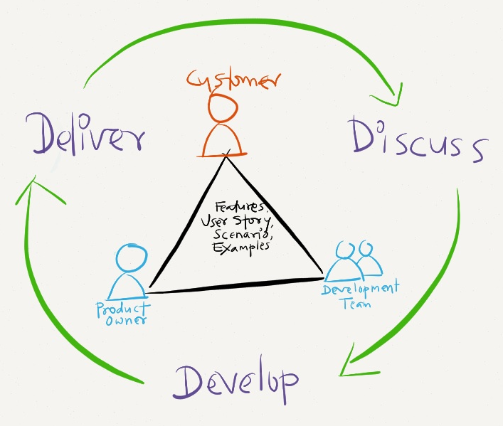
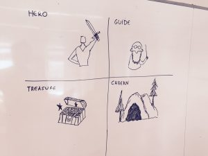
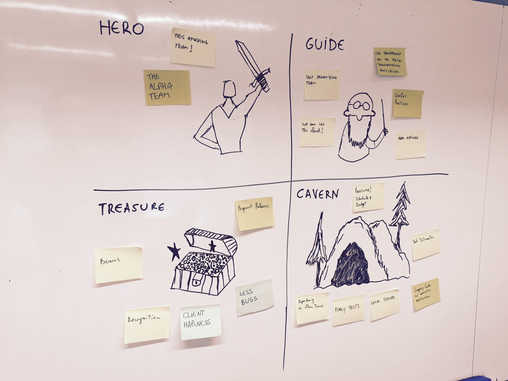
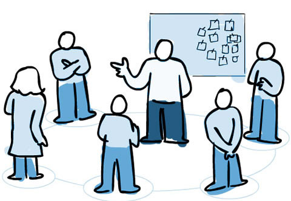

## Ritos do Scrum

### Review Meeting

A Review Meeting é uma reunião que deve ser realizada no final de cada sprint, onde mostra-se para o cliente (e também para o usuário, se possível) tudo o que ficou **pronto** na sprint. Todos os membros do time devem participar. A duração é de, no máximo, 4h para uma sprint de 1 mês.

Porém, o que é **pronto**? A definição de pronto varia de projeto para projeto, de time para time e de momento em momento de projeto. Neste curso vamos estabelecer, sempre que possível a seguinte definição de pronto: **teste de aceitação + desenvolvimento + review de código + aprovação**.

  

Ela funciona de uma forma bem simples, o cliente ou usuário experimenta as funcionalidades desenvolvidas e dá o feedback. O cliente pode encontrar bugs, pensar em melhorias e até novas funcionalidades.

O Product Owner deve tomar notas desses itens acima e adicionar ao Product Backlog na prioridade adequada.

No final da reunião, o time define se a sprint foi bem-sucedida ou mal-sucedida, de acordo com a meta estabelecida na Planning Meeting.

---

### Retrospective Meeting

A Retrospective Meeting é uma reunião para por em prática o conceito de **melhoria contínua**. Nessa reunião, o time se foca em descobrir como melhorar ainda mais o time.  A duração é de, no máximo, 4h para uma sprint de 1 mês.

Há diversos métodos de retrospectivas, neste curso iremos usar a retrospectiva **jornada do herói**:

1 - Explicar o intuito da atividade:

> "Nós estamos aqui reunidos para, coletivamente, escrever nossa jornada do herói."

2 - Descrever as principais áreas da jornada:
- o herói: a pessoa ou o grupo que passará pela jornada;
- o guia: a pessoa ou as coisas que guiam o herói;
- a caverna: os desafios a serem enfrentados;
- o tesouro: as recompensas e conquistas.

  

3 - Pedir aos participantes para escrever em *post-its* notas para cada área:

4 - Conversa e análise:

> "Esta atividade foi realizada para melhorarmos cada vez mais como time. Ela foi muito útil para identificar as pessoas envolvidas, os principais desafios, objetivos desejados e o que é necessário para nos guiar". 

Fonte: [Fun Retrospectives - Hero's Journey](http://www.funretrospectives.com/heros-journey/)

No final dessa reunião, deve ser ter uma lista de **ações** para se fazer na próxima sprint. Uma ação é algo que deve ser feito e que envolve todo o time, como, por exemplo: *o Scrum Master explicar perdas e ganhos da maior participação do cliente*.

---

### Daily Scrum

  

Para enfrenter obstáculos e ter uma maior visibilidade do andamento de tarefas e história na sprint, todo dia **no mesmo horário e local** o time se reúne para responder três perguntas:

- O que eu fiz desde o último daily scrum?
- O que eu pretendo fazer até o próximo?
- Quais problemas me atrapalharam?

A duração dessa reunião não deve passar de 15 minutos. Para isso, apenas devemos apontar problemas, não resolvê-los nela. Caso alguém souber como ajudar, apenas indica que sabe e após a daily os interessados se reunem.

---

### Planning Meeting

A Planning Meeting é uma reunião que deve ser realizada no início de cada sprint, onde é planejado o que cabe na sprint e é definido uma meta para o time. Todos os membros do time devem participar. A duração é de, no máximo, 4h para uma sprint de 1 mês.

Antes da Planning, o Product Owner já deve ter olhado as histórias mais prioritárias do projeto, confirmando o entendimento com o cliente, melhorando a clareza e quebrando funcionalidades grandes em partes menores que ainda continuem entregando valor ao cliente. Esse processo é conhecido como **refinamento** do topo do Product Backlog.

A reunião começa com o Product Owner explicando o item de maior prioridade - tendo em vista que a história de usuário é voltada para negócio, isto é, maior prioridade na perspectiva do cliente/usuário. Após isso, os desenvolvedores tiram dúvidas de entendimento, quebram a funcionalidade em tarefas e discutem em alto nível as dificuldades de implementação, apenas para se atribuir uma estimativa de esforço.

Esse processo se repete para as próximas histórias até o máximo que o time consegue fazer em uma sprint.

Então, os desenvolvedores e o Product Owner negociam quais itens serão feitos na próxima sprint e formam o Sprint Backlog: a lista priorizada das histórias e tarefas que o time planeja fazer nessa sprint.

Uma vez que o Sprint Backlog está definido, o time cria uma **meta** que exprime o valor que será entregue para o cliente/usuário.
